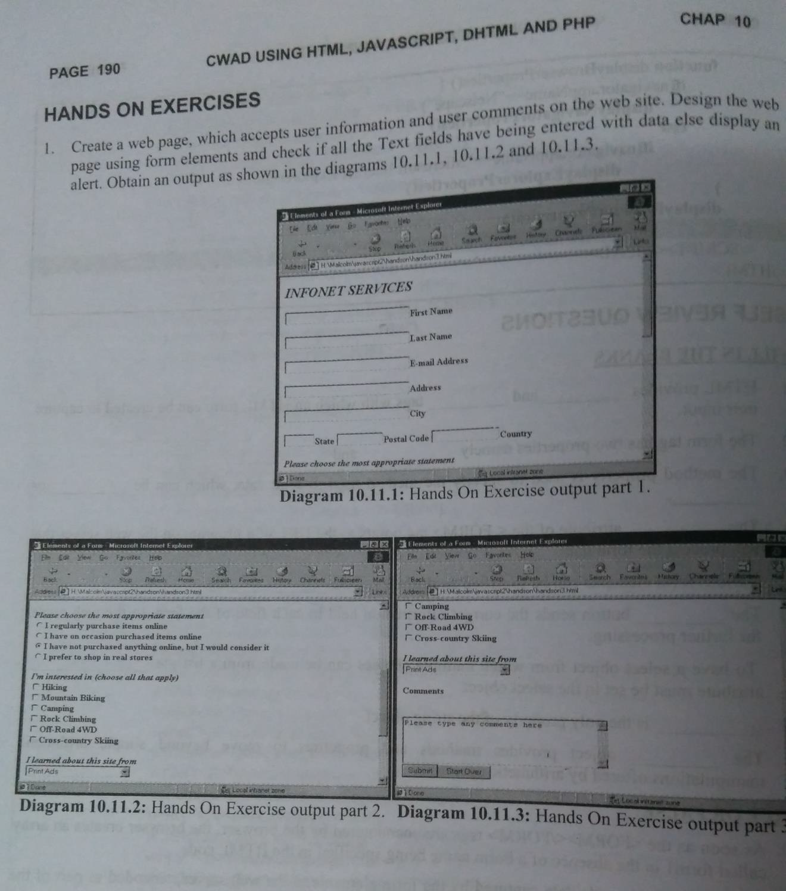

## Internet Technologies Practical Guidelines
* [JAVA](#Java)
* [JavaBeans](#JavaBeans)
* [JDBC](#JDBC)
* [JavaScript](#JavaScript)
* [JSP](#JSP)

### Java
1. Implement a Bank Account having Instance variables: Account Number, Balance and having methods: 
&emsp;&emsp;float Deposit (float x) 
&emsp;&emsp;float withdraw (float x) 
&emsp;&emsp;int get account no () 
&emsp;&emsp;float get balance () 
&emsp;&emsp;tax deduction () 
Then implement class Bank having an array list of accounts of type BankAccount. 
Implement following methods: 
&emsp;&emsp;AddAccount in Bank 
&emsp;&emsp;Get Total balance in Bank 
&emsp;&emsp;Get account number with max. and min. balance 
&emsp;&emsp;Find an account given a bank account no. 
&emsp;&emsp;Count no. of accounts having atleast specific balance
  
2. Implement an Abstract Class Stack with methods push, pop, display for two classes:
StaticStack and DyanamicStack. StaticStack uses one dimensional integer array to store
numbers and DyanamicStack uses an integer ArrayList to store.

### JavaBeans
1. Implement Student JavaBean using Serializability Interface.
2. Implement Employee JavaBean using Serializability Interface.

### JDBC
1. Create Student and Results Database and perform the following using JDBC programs
	1. Find total number of students
	2. Print average marks for each subject input by user.
	3. Find the name of student getting highest marks.
	4. Find no of students getting first, second and third division.
	5. Find subject wise toppers
	6. Find the average marks
	7. Find the student getting second highest marks.
2. Create a procedure in MySQL to count the number of Rows in table 'Student'. Use
CallableStatement to call this method from Java code.

### JavaScript
1. Create a student registration form. Create functions to perform the following checks:
	1. Roll number is a 7 digit numeric value
	2. Name should be an alphabetical value (String)
	3. DOB entered in dd/mm/yy format and should be display in words (e.g. Saturday, January 01, 2000)
	4. Check on non-empty fields
2. Implement a Static Password Protection.
3. Write a java script to sort an array using bubble sort. Take the number of elements and
array from user.
4. Write a JavaScript to implement stack methods (push and pop).
5. Write a JavaScript
	1. to change the color of text using setTimeOut()
	2. to move an image across screen using setInterval()
6. Implement the question no. 1 of hands on exercises of chapter 10 (page 190).

### JSP
1. Display the pattern: 
1 
1&emsp;2 
1&emsp;2&emsp;3 
Take ‘n’ in a textbox from user. Display this pattern using 
	* Scriptlets
	* &lt;c forEach&gt; loop
2. Make two files as follows:
	1. main.html: shows 2 text boxes and 3 radio buttons with values "addition", "subtraction" and "multiplication"
	2. operate.jsp: depending on what the user selects perform the corresponding function (Give two implementations: using request.getParameter() and using expression language)
3. Validate User input entered in a form. The input must include Name, DOB, Email ID, Lucky Number, Favorite food etc. (Refer Chapter 8)
4. Display Good Morning &lt;uname&gt;, Good Afternoon &lt;uname&gt; or Good Evening &lt;uname&gt; based on the current time of the day.
5. Let the user enter a word a in a textbox and let her/him select one of even or odd radio buttons. If she/he selects odd, check the odd positions in the word entered, if they all contain vowels, then display the message ‘You win’, else display ‘You lose’. Similarly, if the user selects even, check for vowels in all even positions in the word entered. Use jstl’s ‘fn’ library.
6. Create your custom library which contains two tags: &lt;hello&gt;, &lt;choco&gt;.
Usage of the tags:
	* &lt;hello name=”Ajay”&gt;: Output should be Hello Ajay. It contains a mandatory attribute ‘name’ which can accept Dynamic value.
	* &lt;choco texture=”Chewy”&gt;: Output should be FiveStar, BarOne. 
	  &lt;choco texture=”Crunchy”&gt;: Output should be Munch. KitKat. 
	  That means the mandatory attribute must accept a value, and based on the attributes value, it should give output. You must use a bean ChocoBean for this purpose.
7. Create a custom tag “substring” with 3 mandatory attributes “input”, “start”, “end” which will do substring operation on given input
8. Create a custom tag “reverse” with a mandatory attribute “input” to reverse a string.
9. Create a custom tag "today" that displays today's date and time
10. Ask a user's name and age on a HTML form. Then display Hello &lt;uname&gt; on a JSP. On the same page ask the product the user would like to buy. Then redirect to another JSP which would display: Hello &lt;uname&gt;, You have ordered &lt;product&gt;. (Use Session Scope Variable using setTag)